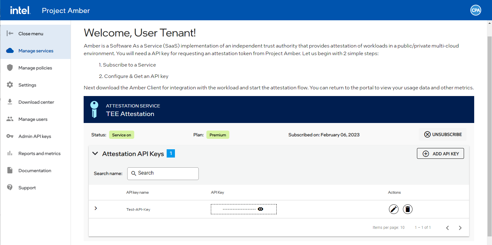

# Project Amber tenant CLI  

The Project Amber Tenant Command-Line Interface (CLI) is a set of commands used by tenants to create and manage Project Amber resources with a focus on ease of use. The Project Amber Tenant CLI must be installed and configured for your environment.

The Project Amber CLI is an open-source tool available on [GitHub](https://github.com/intel/amber-cli).

## Project Amber tenant CLI commands  

The Project Amber CLI contains the following command groups.

- [User Management](cli-user-commands.md) — Used to manage Project Amber users and administrators.
- [Service Management](cli-service-commands.md) — Used to manage Project Amber services.
- [Subscription Management](cli-subscription-commands.md) — Used to manage Project Amber subscriptions.
- [Policy Management](cli-policy-commands.md) — Used to create and update Project Amber policies.

## How to use command line options 

The Project Amber CLI uses the following format:

   `CLI: tenantctl < command > < resource >`  

> [!NOTE]
> If you are behind a proxy, add the Amber `FQDN to NO_PROXY` environment variable.

## Retrieve an attestation API key

An attestation API key is needed to run some API calls against your Project Amber instance. These instructions explain how to retrieve an attestation API key. 

> [!NOTE]
> These instructions assume that your API key has already been created. If you need to create an API Key, follow the [Creating API keys](howto-manage-api-keys.md) steps.

1. Sign in to the Project Amber portal. 
1. Go to the Manage services page.  
      
1. Scroll down to the Attestation API Keys section.  
1. Locate the API from which you want to retrieve the key.  

    > [!NOTE]  
    > You can have more than one API key associated with your account. Be sure to select the appropriate API key for the CLI request you are attempting.   

1. Select the View  icon.
1. Select the Copy  icon. 

## Retrieve Admin API keys

Admin API keys are used to manage users in Project Amber. 

1. Sign in to the Project Amber portal.  
1. Select **Admin API keys**.  
     
1. Select the View  icon for API key you want to copy.  
    The API key is displayed.  
1. Select the copy  icon.   
    The API key is copied to your system memory.   
1. The API key can be used with the Tenant CLI to manage admins and users.   