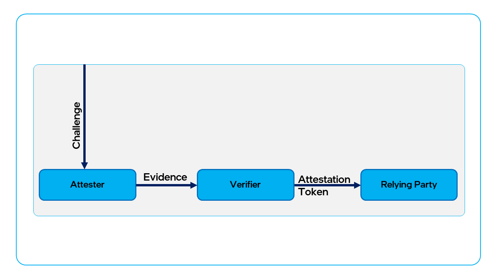

# Attestation process overview

Project Amber provides a trusted remote attestation authority for [TEEs](concept-tees-overview.md) such as [Intel® Software Guard Extensions (Intel® SGX)][intel_sgx] and [Intel® Trust Domain Extension (Intel® TDX)][intel_tdx]. The primary function of Project Amber is to validate the integrity of a remote TEE and to generate an _attestation token_. This article describes the attestation process with a focus on the tasks that the application has to manage. 

The following diagram is a simplified attestation process and serves mainly to introduce the terminology used throughout the Project Amber documentation. This diagram is not a complete representation of the entire attestation process, which is much more complicated than a simple straight-line flow. 



A _challenge_ can come from a wide variety of entities that want to know if the TEE can be trusted before relying on it. A challenge is similar to the authentication process that occurs when you try to sign into email, a banking site, or another service that requires verification of identity. 

The _attester_ is the confidential workload that's making a claim to establish its identity as a valid, trusted entity in a confidential computing environment. The claim is presented as _evidence_ (also called a _quote_) to the _verifier_. In this case, the verifier is Project Amber. 

In the background, not visible to the attester, Project Amber does the following:

- Verifies the nonce, if present.
- Verifies the evidence (quote) provided by the attester.
- Finds [policies](concept-policies.md) associated with the API key and then evaluates the evidence against those policies. 
- Builds and returns an attestation token.

The attestation token returned by Project Amber is sent by the application to a _relying party_ when a confidential workload wants to access protected assets. The relying party is so called because it relies on the attestation authority to verify that the attester is what it claims to be.

The relying party checks the attestation token's signature to verify its authenticity and then checks the token's individual claim elements. Claim elements include the list of matched and unmatched policies and potentially other user data, as explained below in the [Attestation tokens](#attestation-tokens) section. Based on its evaluation of the claims, the relying party will grant or deny access to data and/or services.

At a high level, the TEE workload (that is, the application developer) must do the following steps:

1. Create a quote from the workload’s enclave or trust domain.
1. Request a nonce from Project Amber. This step is optional, but it is strongly recommended to help prevent replay attacks.
1. Request an attestation token from Project Amber.
1. Forward the attestation token to relying parties as needed to access protected assets.

> [!NOTE] 
> These steps can be performed by using (integrating) the [Project Amber client libraries](concept-integrations-overview.md). The more specific steps described in the sections below can be used with the project Amber REST APIs if the client libraries are not suitable for your application's needs.

## Nonce

Project Amber provides a `nonce` feature that mitigates the risk of replay attacks. A nonce is a base64 cryptographic key that is valid for 30 seconds.

For example, if the quote information was somehow leaked, it could be replayed to collect new attestation tokens. To mitigate replay attacks, the `/appraise/v1/nonce` API endpoint is used to create a nonce that is embedded into the quote. When a nonce is applied, Project Amber verifies that the nonce matches the nonce of a verified quote, and that the nonce was created within the last 30 seconds.

To use a nonce when creating a token, do the following.

1. Use Project Amber’s `/appraisal/v1/nonce` REST endpoint to collect a nonce.
1. Extract the `val` field (base64 encoded byte array) from the JSON response.
1. Apply the `val` data when creating a quote.
1. Include the `nonce` JSON from step 1 when calling Amber’s `/appraisal/v1/attest` REST endpoint.

## Quote creation

The specifics of creating a quote depend on the TEE being attested. For example, the steps for quote generation differ somewhat between [Intel SGX](concept-intel-sgx.md) and [Intel TDX](concept-intel-tdx.md), and [Microsoft Azure Attestation (MAA) clients](concept-maa-adapter.md) follow a different process. This action is performed by either the [Project Amber client library](concept-client-integration.md) integrated with your application, or by code internal to your application itself.  

> [!NOTE]
> The [Project Amber REST API](../restapi/restapi-overview.md) can't be used to create a quote, although it performs most other functions available in the integration client libraries.

## Attestation tokens

An attestation token from Project Amber is a [JSON Web Token (JWT)][jwt-rfc7519] consisting of multiple components. Most of these components are _claims_. There are two types of claims, described below: _incoming claims_ and _outgoing claims_. An attestation token includes both incoming and outgoing claims. 

**Incoming** claims include specific elements related to the attested TEE. These elements are related to the combined hardware and software environment of the TEE, which is sometimes referred to as the Trusted-Compute Base (TCB).

**Outgoing** claims are claims made by the verifier (Project Amber) about the attestation process. For example, when Project Amber evaluates the [appraisal policies](concept-policies.md#appraisal-policy), it will append a list of matched and unmatched policies to the incoming claim. These outgoing claims are used by the relying party to decide if it will grant or deny access to protected assets.

For example, in a token attesting an Intel SGX enclave, the enclave's `mrsigner`, indicating the "owner" of the enclave, and `mrenclave`, used to verify the integrity of the enclave code, are outgoing claims that a relying party can validate by comparing them to the expected claims values independently retrieved from the attestation authority.

Attestation tokens contain outgoing claims arrays for `amber_matched_policy_ids` indicating the list of appraisal policies used in attestation that matches against the attested evidence, and `amber_unmatched_policy_ids` indicating a list of policies that did not match the attested evidence. The [sample attestation token for Intel SGX ](#sample-attestation-token-using-default-policy-and-intel-sgx) shows how these outgoing claims appear in the token.

Appraisal policies are optional and can be associated with attestation API keys and can also be specified as part of the REST API call to generate an attestation token. Project Amber has a built-in appraisal policy that is always applied before user-defined policies. If the built-in policy isn't matched, an error will occur.

> [!IMPORTANT] 
> A token will always be generated regardless of whether appraisal policies are matched or unmatched. A token will only fail to be generated in the case of an error, such as when the quote supplied in the request is invalid or missing, or the request fails to match the built-in policies.

### Sample attestation token using default policy and Intel SGX

In this example and those that follow, the ellipsis ( ... ) and spaces are not part of the actual value. The actual alphanumeric values are often very long and are shortened here for presentation. 

```json
{
  "amber_trust_score": 10,
  "amber_report_data": "0000000000000000000000000000000 ... 000000000000000000000000",
  "amber_tee_held_data": "AQ ... SxlA==",
  "amber_sgx_mrenclave": "000000000000000000000000000 ... 0000000000000000000000000000",
  "amber_report_data": "0000000000000000000000000000000 ... 000000000000000000000000",
  "amber_tee_held_data": "AQ ... SxlA==",
  "amber_sgx_mrenclave": "000000000000000000000000000 ... 0000000000000000000000000000",
  "amber_tee_is_debuggable": false,
  "amber_sgx_mrsigner": "000000000000000000000000000 ... 000000000000000000000000000000",
  "amber_sgx_mrsigner": "000000000000000000000000000 ... 000000000000000000000000000000",
  "amber_sgx_isvprodid": 0,
  "amber_sgx_isvsvn": 0,
  //
  "amber_unmatched_policy_ids": [
    "00000000-00000000-00000000-00000000"
  ],
  "amber_matched_policy_ids": [
    "00000000-00000000-00000000-00000000",
    "00000000-00000000-00000000-00000000",
    "00000000-00000000-00000000-00000000",
    "00000000-00000000-00000000-00000000"
  ],
  //
  "amber-faithful-service-ids": [
    "00000000-00000000-00000000-00000000",
    "00000000-00000000-00000000-00000000"
  ],
  //
  "amber_tcb_status": "OK",
  "amber_evidence_type": "SGX",
  "amber_signed_nonce": true,
  "amber_custom_policy": {},
  //
  "ver": "1.0",
  "exp": 1666287698,
  "jti": "00000000-00000000-00000000-00000000",
  "iat": 1666287368,
  "iss": "AS Attestation Token Issuer"
}
```

### Attestation claims

Attestation claims include the Internet Engineering Task Force ([IETF][ietf]) Entity Attestation Token (EAT) standard attestation elements, as well as a set of custom elements defined by Project Amber.

#### IETF-EAT standard claims

| Field name | Claim type   | Description          |
| ---------- | ------------ | -------------------- |
| iat        | Outgoing     | Token issued time    |
| exp        | Outgoing     | Token expiry time    |
| iss        | Outgoing     | Token issuer      |
| jti        | Outgoing     | JWT identifier |
| ver        | Outgoing     | Token version     |

```json
  "ver": "1.0",
  "exp": 1666287698,
  "jti": "00000000-00000000-00000000-00000000",
  "iat": 1666287368,
  "iss": "AS Attestation Token Issuer"
```

#### Custom attestation claims

| Field name    | Claim type   | Description  |
| ---- | ---- | ------ |
| amber\_evidence\_type | Outgoing | TEE type — tee-sgx, tee-tdx, tee-tpm, tee-amd-snp, Tee-arm-realm |   
| amber\_tcb\_status    | Outgoing     | The PCK certificate contains the TCB Level of the platform, and the SEAM SVN is found in the quote body. The verifier looks up the current status of the TCB by looking these values up in the TCB Info structure, which will yield a TCB Status. |
| amber\_advisory\_ids | Outgoing     | An array of Advisory IDs describing vulnerabilities that this TCB level is vulnerable to, for example, \[ "INTEL-SA-00079", "INTEL-SA-00076" \] <br> The value can be different for different FMSPCs. <br> This field is optional. It will be present only if the list of Advisory IDs is not empty.   |
| amber\_trust\_score   | Outgoing     | 0 untrusted/ 10 trusted  |
| amber\_instance\_ids   | Outgoing   | Instance IDs of different services involved in the attestation   |

### Incoming TEE claims

TEE claims will differ based on the TEE attested (for example, Intel SGX or Intel TDX).  These claims relate to the information from the evidence provided in the quote used for attestation.

```json
  "amber_tee_held_data": "AQ ... SxlA==",
  "amber_sgx_mrenclave": "0000000000000000000000000 ... 00000000000000000000000000000",
  "amber_tee_held_data": "AQ ... SxlA==",
  "amber_sgx_mrenclave": "0000000000000000000000000 ... 00000000000000000000000000000",
  "amber_tee_is_debuggable": false,
  "amber_sgx_mrsigner": "000000000000000000000000000000 ... 000000000000000000000000000",
  "amber_sgx_isvprodid": 0,
  "amber_sgx_isvsvn": 0,
```

#### Intel SGX claims

| Claim    | Datatype | Description  |
| -------- | -------- | --- |
| amber\_sgx\_mrsigner   | string   | MR signer — Hash of the enclave signing key, used to identify the "owner" of the enclave.  |
| amber\_sgx\_mrenclave  | string  | MR enclave — Hash of the enclave measurement, used to verify the integrity of the enclave code.    |
| amber\_sgx\_isvsvn         | int      | ISV SVN — Security Version of the enclave.   |
| amber\_sgx\_isvprodid      | int      | ISV Product ID — Enclave Product ID.<br><br>The ISV should configure a unique `ISVProdID` for each product that may want to share sealed data between enclaves signed with a specific `MRSIGNER`. The ISV may want to supply different data to identical enclaves signed for different products. |
| amber\_tee\_is\_debuggable | bool     | Flag denoting if TEE is debuggable (Recommended to always be `false`) |

#### Intel TDX claims

| Claim   | Datatype | Description  |
| ------------- | -------- | --------- |
| amber\_tdx\_seamsvn      | int      | Seam SVN — SEAM Security Version Number — Version number that indicates when security-relevant updates have occurred. A new revision can be released without incrementing the SVN if no security-related changes are made. |
| amber\_tdx\_rtmr0        | string   | RTMR 0 — Array of NUM\_RTMRS<br><br>(TDX1: 4) runtime extendable measurement registers   |
| amber\_tdx\_rtmr1        | string   | RTMR 1 — Array of NUM\_RTMRS<br><br>(TDX1: 4) runtime extendable measurement registers     |
| amber\_tdx\_rtmr2        | string   | RTMR 2 — Array of NUM\_RTMRS<br><br>(TDX1: 4) runtime extendable measurement registers    |
| amber\_tdx\_rtmr3        | string   | RTMR 3 — Array of NUM\_RTMRS<br><br>(TDX1: 4) runtime extendable measurement registers     |
| amber\_tdx\_mrtd         | string   | MRTD — Measurement of the initial contents of the TD |
| amber\_tdx\_mrsignerseam | string   | MR Signer Seam — Measurement of SEAM module signer. (Not populated for Intel® SEAM modules)<br><br>This field is optional and only populated on TDX TCBINFOs.  |
| amber\_tdx\_mrseam       | string   | MR Seam — Measurement of the SEAM module (Secure Arbitration Mode (SEAM) is an extension to Virtual Machines Extension (VMX) architecture to define a new VMX root mode called SEAM root.)                                 |

### Outgoing policy claims

Policy claims list the [appraisal policies](concept-policies.md#appraisal-policy) used for this attestation request, grouped by _matched_ policies where the evidence met the policy requirements and _unmatched_ policies where there was a mismatch between the evidence and the policy requirements.  

| Field name      | Claim type    | Description  |
| ----- | ------- | ------ |
| amber\_matched\_policy\_ids   | Outgoing   | Matched policies — Evaluated true policies against the quote    |
| amber\_unmatched\_policy\_ids | Outgoing   | Unmatched policies — Evaluated false policies against the quote |
| amber\_custom\_policy         | Outgoing   | The customized contents from the token customization policy.    |

```json
  "amber_unmatched_policy_ids": [
    "00000000-00000000-00000000-00000000"
  ],
  "amber_matched_policy_ids": [
    "00000000-00000000-00000000-00000000",
    "00000000-00000000-00000000-00000000",
    "00000000-00000000-00000000-00000000",
    "00000000-00000000-00000000-00000000"
  ],
```

### Faithful verification claims

Project Amber includes the instance IDs for the individual microservices used to produce the token. This allows an audit of the services that produced the token to help ensure that each microservice involved in token creation was itself running in a TEE, in a verified, attested, "faithful" state.  For more information on faithful verification, see [Faithful Verifier](concept-faithful-verifier.md).

| Field name   | Claim type    | Description   |
| ---- | ----- | ------ |
| amber-faithful-service-ids  | Outgoing    | Array of the microservice instance IDs for the services used to generate the token    |

```json
  "amber-faithful-service-ids": [
    "00000000-00000000-00000000-00000000",
    "00000000-00000000-00000000-00000000"
  ],
```

## Next steps

The following topics will help you learn more about Project Amber attestation and how to integrate Project Amber into your application. 

- [Appraisal and token modification policies](concept-policies.md)
- [Project Amber integrations](concept-integrations-overview.md)
- [REST API](../restapi/restapi-overview.md)
- [Use cases for Project Amber](concept-usecases-overview.md)


<!-- External link URLs -->
[jwt-rfc7519]: https://www.rfc-editor.org/rfc/rfc7519
[ietf]: https://www.ietf.org/
[intel_sgx]: https://www.intel.com/content/www/us/en/developer/tools/software-guard-extensions/overview.html
[intel_tdx]: https://www.intel.com/content/www/us/en/developer/articles/technical/intel-trust-domain-extensions.html