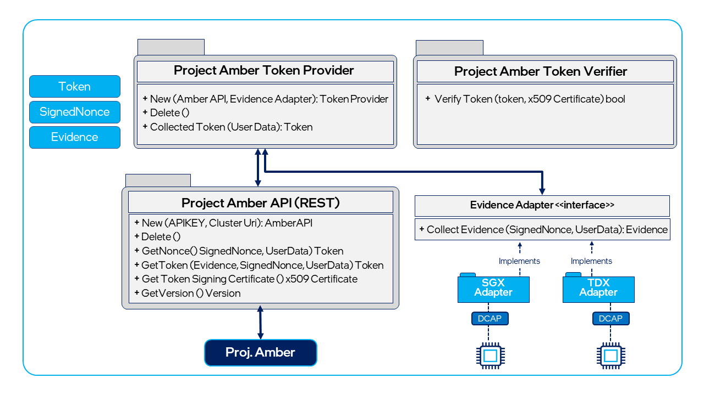

# Project Amber client integration
 
Intel’s Project Amber client is a collection of libraries that is used to integrate a native [TEE](concept-tees-overview.md) [enclave][enclave-pdf] or [trust domain][tdx-whitepaper] with Project Amber. The term _native TEE enclave_ applies to the use case in which an untrusted application loads a trusted TEE enclave that is not running within a libOS such as Gramine.

The Project Amber client library is designed to minimize the changes needed to adapt your existing Go-language applications to use Project Amber attestation. The Project Amber client encapsulates all of the functions and workflows required to generate a quote, package it as evidence, and send it to the Project Amber Quote Verification Service, just by calling the Project Amber APIs. Project Amber client libraries are intended to be used both for workloads and relying parties, so that only one collection of libraries is deployed with your application. 

Currently the Project Amber client is offered for Golang only. Additional language bindings for the Project Amber client libraries for popular languages are planned for future release based on customer needs.

## Prerequisites

This article assumes the reader has a working understanding of development using one or more TEEs, such as [Intel® Software Guard Extensions (Intel® SGX)][sgx-dev] development, [Intel® Trust Domain Extension (Intel® TDX)][tdx-dev] development, and [Enclave Definition Language (EDL)][edl-vid]. Readers that want to integrate with Project Amber but are not familiar with  development using these technologies may want to use [Gramine integration](concept-gramine-integration.md).

## Getting started with Project Amber integration

The first step in getting started as a Project Amber client developer is to create a developer account and get an attestation API key. You can't use the client libraries until you have an API key.

## Project Amber Go client overview

The Project Amber Go-language client consists of four Go modules that can be found at in the [GitHub repo][github-client-repo].

[**go-client**](integrate-go-client.md) — This module is responsible for creating a secure connection to Project Amber and invoking the attestation-related REST APIs of Project Amber. Developers who only need to interact with Project Amber via REST (that is, _not_ collecting TEE quotes) can import this module into their application and call the interfaces exposed.

[**go-sgx**](integrate-go-sgx.md) — This module is responsible for generating an Intel SGX quote. 

[**go-tdx**](integrate-go-tdx.md) — This module is responsible for remotely attesting an Intel TDX workload. 

[**amber-cli-tdx**](integrate-go-tdx-cli.md) — This module provides an Intel TDX command-line interface (CLI) implementation. 
    
The following diagram shows the Project Amber client interfaces and adapters, and the logical data flow between client components.

The Intel SGX attestation and Intel TDX attestation adapters (clients) are supported as of this writing.

Adapters are partly developed in C++ to work with Intel SGX/Intel TDX Data Center Attestation Primitives (DCAP). The Go clients encapsulate low-level calls to the adapter. The next few sections give a summary of the interfaces exposed according to client.

### go-client

This module is responsible for creating a secure connection to Project Amber and invoking the attestation-related REST APIs of Project Amber. Developers who only need to interact with Project Amber via REST (that is, _not_ collecting TEE quotes) can import just this module for use in their application.

- `client.new`: Initializes an instance of Project Amber client to be used for communication with Amber. It takes the Project Amber base URL and an API key as input.

- `client.CollectToken`: Interfaces with Project Amber to get the attestation result for the workload. It takes `EvidenceAdapter` and Project Amber attestation policy IDs as input and provides an Project Amber attestation token as output.

- `client.GetNonce`: Retrieves a new signed nonce from Project Amber to be used for enclave report creation. It does not take any input.

- `client.GetToken`: Creates a new Project Amber attestation token corresponding to an input SGX quote. It takes Project Amber signed nonce, Project Amber attestation policy IDs and Evidence (an SGX quote) as input.

- `client.VerifyToken`: Verifies the Project Amber attestation token to ensure that the token is generated from a genuine Project Amber Attestation Service. It takes an Amber attestation token as input.

<!-- External link URLs -->
[enclave-pdf]: https://www.intel.com/content/dam/develop/external/us/en/documents/overview-of-intel-sgx-enclave-637284.pdf
[tdx-whitepaper]: https://cdrdv2.intel.com/v1/dl/getContent/690419
[sgx-dev]: https://www.intel.com/content/www/us/en/developer/tools/software-guard-extensions/get-started.html
[tdx-dev]: https://www.intel.com/content/www/us/en/developer/articles/technical/intel-trust-domain-extensions.html
[github-client-repo]:  https://github.com/intel/amber-client
[edl-vid]: https://www.intel.com/content/www/us/en/developer/videos/introduction-to-the-enclave-definition-language-intel-sgx.html