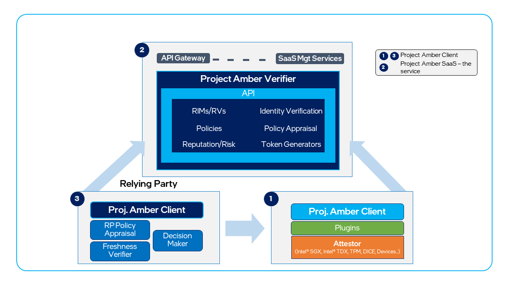

# Understanding Project Amber integrations

The articles in the [Integrations](integrate-overview.md) section of this documentation contain information on how to integrate Project Amber into your applications. Integration refers to the process of using the Project Amber client libraries to add quoting and attestation functions to an existing application. The Project Amber client encapsulates all of the functions and workflows required to generate a quote, package it as evidence, and send it to the Project Amber service by calling the Project Amber APIs. A key integration goal of the Project Amber client is to minimize needed changes to existing applications. 

You can also use Project Amber remote attestation via the [Project Amber REST API](../restapi/restapi-overview.md).

Project Amber integration have two major component systems: 

- A Project Amber SaaS (Software-as-a-Service) deployment that you interact with via the APIs. The Project Amber service is a collection of microservices that are instantiated on demand to perform different functions, such as policy appraisals, quote verification, and [TEE](concept-tees-overview.md) caching. 

- Project Amber Go-language client libraries that are integrated with the workload application code to provide attestation, evidence-quoting capability, and an interface to the Project Amber SaaS microservices.

The Project Amber client is for use with applications that utilize TEE SDKs, such as the Intel® Software Guard Extensions SDK for Linux* OS (Intel® SGX SDK for Linux* OS) or Intel® Software Guard Extensions SDK for Windows* OS (Intel® SGX SDK for Windows* OS). 

Use the Project Amber client for applications intended to run in Gramine Shielded Containers (GSC). For more information, see [Project Amber Gramine integration](concept-gramine-integration.md).

## Attestation client library

The following diagram shows the Project Amber attestation client library, its functions, and modules (libraries).

The Project Amber client is split into several different libraries (files) so that they can be deployed for specific use cases. All TEE adapters are separate libraries, allowing you to include only the libraries that are relevant to the TEE(s) you're using. For example, a relying party may only need the Project Amber APIs to facilitate REST communications with Project Amber. 

- The `AmberClient` library is the key library that interfaces with the Project Amber service by using a REST API.

- The `CollectToken` function simplifies token collection. It is an aggregate function that implements the full workflow to request a nonce from the Project Amber service, invoke the appropriate `EvidenceAdaptor`, package the evidence, and then invoke the Project Amber service API to fetch the attestation token.

- The `EvidenceAdapter` interface abstracts the collection of platform specific evidence (quotes).  Evidence adapters are developed as individual libraries to promote expansion and minimize the dependency chain. For example, a user of Intel TDX does not need to install the binaries for Intel SGX.

- The Project Amber client provides a unified library for both workload owners and relying parties. A relying party can use the same libraries used by the workload when using the background attestation model.

For more information, see [Project Amber client integration overview](concept-client-integration.md), [Go integration overview](integrate-overview.md), and [Go client](integrate-go-client.md).

## Amber client for Gramine

Project Amber supports using [Gramine](https://gramineproject.io/). Gramine is a lightweight library operating system (libOS) designed to allow an entire application to run in an enclave with minimal or no changes needed to the application itself. To facilitate the goal of few-to-no changes to existing applications, the Project Amber Gramine client is natively integrated into the Gramine LibOS. 

For more information, see [Project Amber Gramine integration overview](concept-gramine-integration.md) and [Gramine client](integrate-gramine.md)

