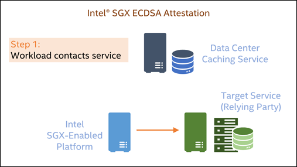

# Intel® Software Guard Extensions (Intel® SGX)

This article provides information related to Intel® Software Guard Extensions (Intel® SGX) and is focused on the requirements needed to enable Intel SGX-enabled applications to provide quote capabilities.

For more information about Intel SGX, see [Intel's main SGX product page][sgx-overview].

At a high level, attestation with Intel® SGX requires the following:

- Hardware supporting Intel SGX provisioned using the Intel® Software Guard Extensions Provisioning Certification Service (Intel® SGX Provisioning Certification Service).
- Intel SGX driver support in the operating system kernel.
- Intel® Software Guard Extensions Data Center Attestation Primitives (Intel® SGX DCAP) to provide quoting capability to Intel SGX-enabled applications.
- An attestation authority such as Project Amber.

## Working with Intel® SGX

Intel SGX uses the Elliptic Curve Digital Signature Algorithm (ECDSA) attestation architecture.

A sample high-level flow of an Intel SGX ECDSA attestation is shown above.

1. The enclave workload contacts the relying party and requests access to a service or resource.

1. The relying party responds by issuing a challenge that asks the Intel SGX workload to identify itself and provide proof that its credentials are valid.

1. To satisfy the challenge, the Intel SGX workload generates a quote, which is a cryptographic measurement of the instantiated enclave. The quote is signed using the attestation collateral that’s stored in the data center caching service.

1. The quote is sent to the relying party over a secure communications channel.

1. The relying party verifies the quote by fetching the attestation collateral associated with the quote from the data center caching service and using it to verify the signature.

1. Assuming the quote is valid, the relying party examines the quote metadata and the trusted-compute base (TCB) level that is associated with the signing key. The service then applies its security policy and decides whether it should trust the enclave.

For more information, see the [Intel® Provisioning Certification Service for ECSDA Attestation][ecdsa-overview].

Beyond the Intel SGX-capable hardware and the Intel SGX-enabled workload itself, this attestation flow has a few key requirements. The intent of this article is to clarify these requirements and how they can fit with your software and/or data center architecture.

### Provisioning certification

Intel SGX ECDSA attestation requires that physical SGX-enabled hosts have access to the [Intel SGX Provisioning Certification Service][PCS] to provision certificates needed for the attestation process.  While it is possible for hosts to have direct access to this service, most data centers prefer to use a caching service instead. A caching service can be a single point of contact to Intel SGX Provisioning Certification Service over the internet, and Intel SGX hosts in the data center can connect only to the caching service rather than requiring an external internet connection for provisioning. The [Project Amber TEE Caching Service](concept-tcs.md) is an example of a caching service that can be used with Intel SGX.

This requirement is only needed for the bare-metal physical Intel SGX servers. Public cloud customers working with Intel SGX-enabled cloud service providers (CSPs) do not need a caching service or access to the Intel PCS, as that functionality is provided by the CSP.

### Intel SGX driver in the kernel

Intel® SGX requires driver support at the kernel level. For Linux, this support was added in the Linux kernel 5.11 and later.

[!INCLUDE[Install DCAP for Ubuntu](include/install-dcap.md)]

### Enclave Page Cache (EPC) memory

Intel SGX requires that Enclave Page Cache (EPC) memory must be allocated to SGX enclaves. For physical Intel SGX hosts, EPC memory is configured in the system BIOS. Cloud service providers typically include EPC memory allocations for their Intel SGX-enabled offerings. The amount of EPC memory required depends on the size of the enclave; a small cryptographic toolkit library may only require a few megabytes of EPC memory.

Because Gramine encapsulates the entire application within an Intel® SGX enclave, more EPC memory is required than utilizing enclaves only for specific application libraries. Be sure that enough EPC memory is available to run the entire "graminized" application.

<!-- External link URLs -->
[sgx-overview]: https://www.intel.com/content/www/us/en/developer/tools/software-guard-extensions/overview.html
[ecdsa-overview]: https://www.intel.com/content/www/us/en/developer/articles/technical/quote-verification-attestation-with-intel-sgx-dcap.html
[PCS]: https://api.portal.trustedservices.intel.com/provisioning-certification