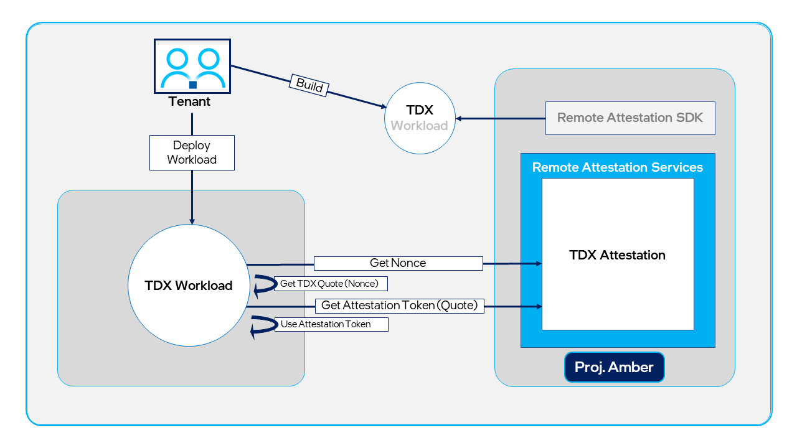
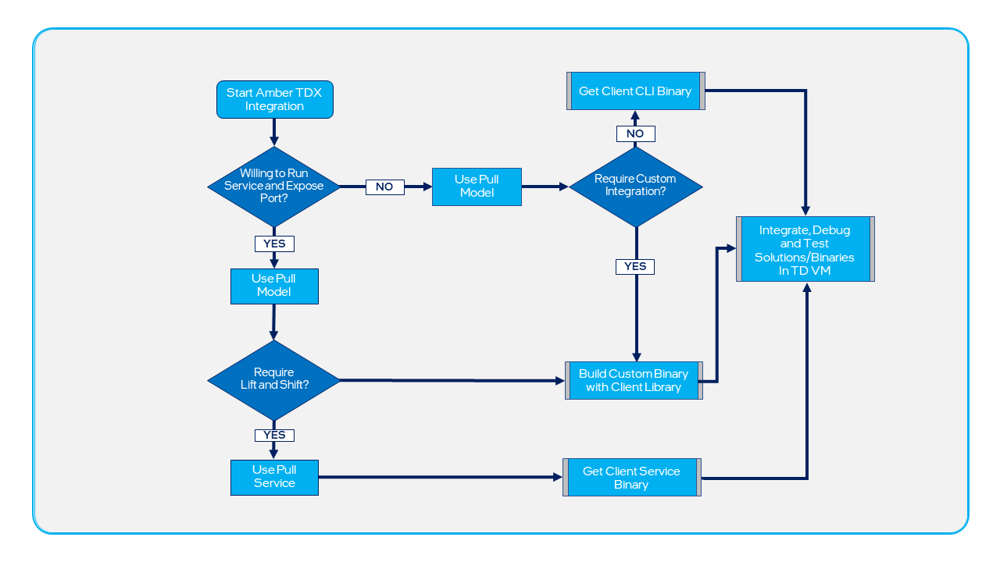

# Intel® Trust Domain Extension (Intel® TDX)

[Intel® Trust Domain Extension (Intel® TDX)][tdx-overview] allows you deploy hardware-isolated virtual machines (VMs) called trust domains (TDs). A TD VM is isolated from the virtual machine manager (VMM), hypervisor, and other non-TD software on the host platform. This removes the host platform from the trusted computing base (TCB). Intel TDX protects against a variety of software and hardware attacks. Intel TDX reduces the _trusted compute base_, which is the software that runs in the TD. 

Intel TDX workloads are primarily VM images that tenants want to run as TDs in a cloud environment. To run a VM in a TD, special Open Virtual Machine Firmware (OVMF), supplied by the cloud service provider, is required.

 ## Intel® TDX remote attestation

Project Amber remote attestation enables a relying party to establish that a workload is running on an Intel TDX-enabled platform that is located in a TD. Remote attestation allows service owners and consumers to digitally determine the version of the trusted computing base in the TD. Intel TDX remote attestation is exposed via Project Amber REST endpoints that are invoked by remote workloads running in the TD.

The following diagram shows the remote attestation flow for a Intel TDX application (workload). The light gray elements represent development tasks.

## Decision diagram

The following diagram shows how a developer can decide the best approach (push or pull mode) for integrating the Intel TDX client into their trust domain VM solution. For more information about push/pull mode, see [Project Amber use cases](concept-usecases-overview.md).

<!-- External URLs -->
[tdx-tools]: https://github.com/intel/tdx-tools <!-- Linux stack for TDX repo -->
[tdx-overview]: https://www.intel.com/content/www/us/en/developer/articles/technical/intel-trust-domain-extensions.html
