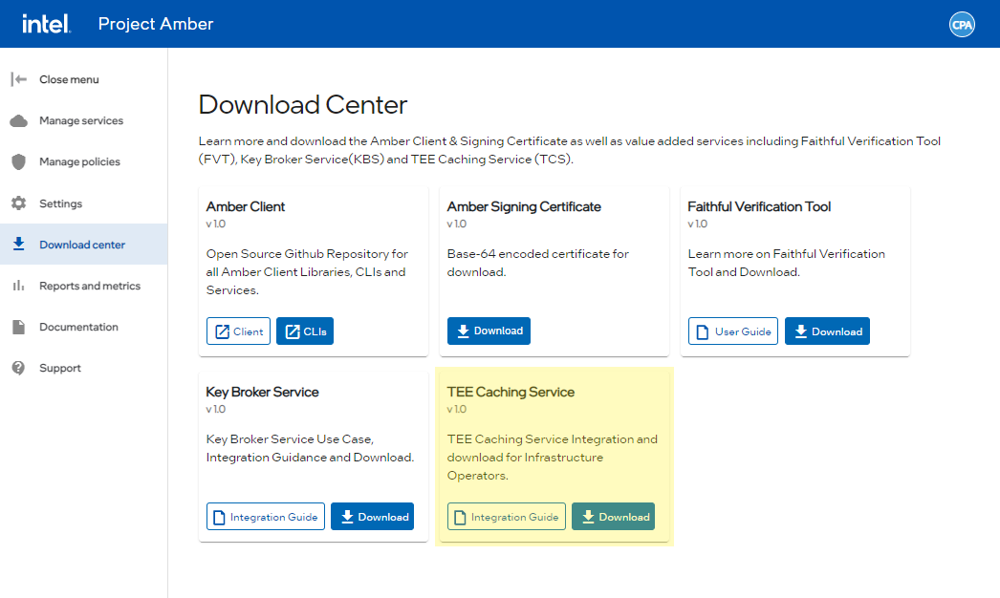

# TEE Cache Service (TCS)  

The Project Amber Trusted Execution Environment Caching Service (TCS) provides a local cache of platform collaterals needed for quote verification. TCC helps reduce quote-verification latency, and it allows administrators to limit internet connectivity to scheduled times.

When a workload makes a request for attestation, the Project Amber Quote Verification Service (QVS) makes a request to Data Center Attestation Primitives (DCAP) to collect the platform collaterals needed for quote verification. TCS checks to see if the platform collaterals are cached locally. If present, TCS returns that information to QVS. If the requested platform collaterals are not present, TCS collects the required information from the appropriate Provisioning Certification Service.

TCS performs the following functions:

- Fetches and caches provisioning certification keys (PCKs) for the trusted-compute base (TCB).  
- Fetches and caches platform collaterals, including:   
    - TCB information
    - PCK CRL (Certificate Revocation Lists for PCK Certificates)  
    - Quoting enclave identity information  
- Periodically refreshes PCK certificates and platform collaterals  

## Prerequisites

Complete these tasks before installing the TCS. 

- Install version 1.18.6 of Go (https://go.dev/dl/) on the build machine.
- Install version 11 or later of the Postgres database (https://www.postgresql.org). 
- Create a database in Postgres.

## Install TCS 

The TCS package is downloaded from the Project Amber web interface.  

1. Log into the Project Amber web UI.   

1. Select **Download center** in the left-hand column.  

1. To download the TEE Caching Service package `tcs-v0.3.0.bin`, select **Download** in the TEE Cashing Service section.  

        

1.	Export the following variables before installation:  

    - export TCS_DB_USER=`<tcs-db-user-name from pre-req>`  
    - export TCS_DB_NAME=`<tcs-db-password>`  
    - export TCS_DB_PASSWORD=`<tcs-db-password>`  
    - export TCS_ENABLE_TLS=`true #accept true/false`  
    - export TCS_DB_PORT=`5432`  
    - export TCS_DB_HOST=`<tcs-db-hosts>`  
    - export SGX_PROV_CERT_SERVER_API_KEY=`<PCCS_SERVER_KEY>`  
    - export SGX_PROV_CERT_SERVER_URL=`<PCCS URL>`    
    
 1. Reference PCS: `https://api.portal.trustedservices.intel.com/provisioning-certification`    This service supports SGX ECDSA Attestation by providing APIs for retrieving provisioning certificates, revocation lists, and trusted computing base (TCB) information for a SGX-enabled enclave. The user needs to register the endpoint to the service prior to using it.   

1.	Use the following command to run the TCS installer in the background.  

    `./tcs-v0.3.0.bin`  

1.	Check the TCS logs by running the following command:  

    `journalctl -u -f tcs`  

