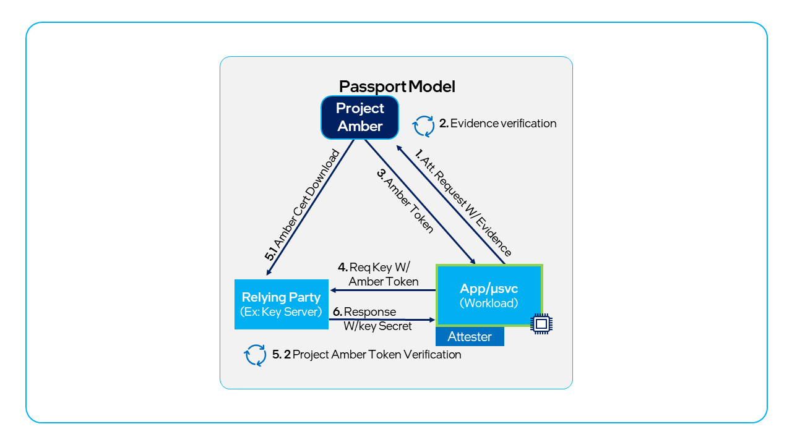
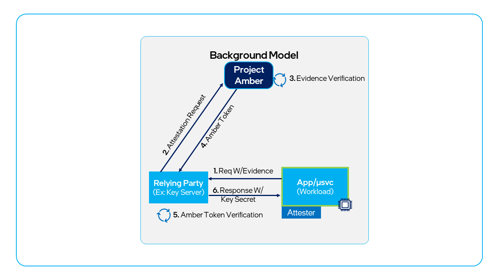

# Use cases for Project Amber

This article provides examples of how Project Amber can be used in a variety of industries to implement attestation-based security controls.

## Passport model

The _Passport_ model is when the workload (the (attester) collects evidence (a quote) and provides it to Project Amber (the verifier) to get an attestation token that is provided to a relying party. This can be done in a _Push_ flow, where the attesting workload requests the attestation token and sends it to the relying party, or in a _Pull_ flow, where a relying party requests an attestation token or evidence from the attesting workload.

### Passport push

A workload (the attester) gets an attestation token from Project Amber (the verifier) and sends it to a monitoring service (a relying party) that tracks the workload's status.

- An application starts as a [Gramine container](concept-gramine-integration.md) with Project Amber integrated on an SGX-capable platform.
- During startup, the application reads the `/dev/amber/token` file, generating an Intel® SGX quote of the Gramine enclave and requesting a new attestation token.
- The application sends the resulting attestation token to a monitoring service.
- The monitoring service uses the [Project Amber client](concept-client-integration.md) `go-client.VerifyToken` method to verify the token signature. This also returns the token claims.
- The monitoring service validates the `MRSIGNER` value from the token claims against the hash of the enclave signer's public key to verify that the application is genuine (verifying the enclave signing authority, the private key used to sign the enclave).

### Passport pull

A monitoring service (a relying party) calls the workload (the attester) to initiate the collection of a token from Project Amber (the verifier) that is returned to the service to track the workload status.

- An application uses one or more pods that use [Gramine container images](concept-gramine-integration.md) with Project Amber integrated on an Intel® SGX-capable platform.
- A monitoring service periodically requests an attestation token from each container in the pod.
- When requested, the application reads the `/dev/amber/token` file, generating an Intel® SGX quote of the Gramine enclave and requesting a new attestation token.
- The application sends the resulting attestation token to the monitoring service.
- The monitoring service uses the [Project Amber client](concept-client-integration.md) `go-client.VerifyToken` method to verify the token signature. This also returns the token claims.
- The monitoring service validates the `MRSIGNER` value from the token claims against the hash of the enclave signer's public key to verify that the application is genuine (verifying the enclave signing authority, the private key used to sign the enclave).

## Background model

The _Background Check_ model is when the workload (the attester) provides evidence (a quote) to a relying party that uses it to collect an attestation token from Project Amber (the verifier). This can be done in a push flow, where the attesting workload requests the attestation token and sends it to the relying party, or in a pull flow, where a relying party requests an attestation token or evidence from the attesting workload.  

### Background push

A workload (the attester) pushes a quote (evidence) to a monitoring service (a relying party) that gets a token from Project Amber (the verifier) that is used to track the workload's status.

- An application using an Intel® SGX enclave uses the [Project Amber client](concept-client-integration.md) `go-client.GetNonce` method to generate a nonce.
- The application then uses the Project Amber client `go-sgx.NewAdapter` method to invoke DCAP quote generation APIs. 
- The application uses the `go-sgx.CollectEvidence` method to get the enclave report and quote, using the nonce generated earlier.
- The application sends this quote along with enclave UserData to a monitoring service, which calls the Project Amber [Attestation API](~/restapi/restapi-attestation.md) to generate an attestation token.
- The monitoring service uses the Project Amber client `go-client.VerifyToken` method to verify the token signature. This also returns the token claims.
- The monitoring service validates the `MRSIGNER` value from the token claims against the hash of the enclave signer's public key to verify that the application is genuine (verifying the enclave signing authority, the private key used to sign the enclave).

### Background pull

A monitoring service (a relying party) calls a workload (the attester) to get a quote (evidence) that is passed to Project Amber (the verifier) to collect a token that is used to track the workload status.

- An application uses one or more pods that use [Gramine container images](concept-gramine-integration.md) with Project Amber integrated on an SGX-capable platform.
- A monitoring service periodically requests an Intel® SGX quote from each container in the pod.
- When requested, the application uses the Project Amber client `go-sgx.NewAdapter` method to invoke DCAP quote generation APIs. 
- The application uses the `go-sgx.CollectEvidence` method to get the enclave report and quote, using the nonce generated earlier.
- The application sends this quote along with enclave UserData to a monitoring service, which calls the Project Amber [Attestation API](~/restapi/restapi-attestation.md) to generate an attestation token.
- The monitoring service uses the Project Amber client `go-client.VerifyToken` method to verify the token signature. This also returns the token claims.
- The monitoring service validates the `MRSIGNER` value from the token claims against the hash of the enclave signer's public key to verify that the application is genuine (verifying the enclave signing authority, the private key used to sign the enclave).

## Key release model

A common use case for attestation is to request access to protected secrets like cryptographic keys, and authorize access only given a valid attestation token meeting security requirements. This can be done in a push flow, where the attesting workload requests the attestation token and sends it to the relying party to request secrets, or in a pull flow, where a relying party requests an attestation token or evidence from the attesting workload and then sends a secret to workloads with compliant attestation results.

### Key release, passport push

A workload (the attester) sends a quote (evidence) to Project Amber (the verifier) that returns a token. The workload sends the token to a key management system (a relying party) to release a key that the workload can use to decrypt sensitive information.

- An application starts as a [Gramine container](concept-gramine-integration.md) with Project Amber integrated on an Intel® SGX-capable platform.
- During startup, the application reads the `/dev/amber/token` file, generating an Intel® SGX quote of the Gramine enclave and requesting a new attestation token.
- The application sends the resulting attestation token to a Key Broker Service (KBS) to request a needed private key.
- The KBS has a Key Transfer Policy defining the authorization requirements in the attestation token needed to provide access to the private key. In this case, the key transfer policy requires a specific `MRSIGNER` value.
- The KBS validates the `MRSIGNER` value from the token claims against the key transfer policy requirement. If the policy matches, the KBS returns the private key, encrypted using the `USERDATA` public key from the Intel® SGX quote passed through the attestation token.  This way, only the Intel® SGX enclave that provides the quote is capable of decrypting the application's private key.

### Key release, passport pull

A third-party solution (a relying party) calls the workload (the attester) to get a token. The workload collects a quote (evidence) and sends it to Project Amber (the verifier) to get the token and return it to the third-party solution. The third-party solution sends the token to a key management system to release a key that can be returned to the workload to decrypt sensitive information.

- A key management service holds a signing key that an authentication application requires to sign issued authentication tokens.
- The key management service requests an Intel® SGX quote from the authentication service, which has integrated the [Project Amber client](concept-client-integration.md) and runs on an Intel® SGX-enabled host.
- The authentication service uses the Project Amber client `go-client.GetNonce` method to generate a nonce.
- The authentication service uses the Project Amber client `go-sgx.NewAdapter` method to invoke DCAP quote generation APIs. 
- The authentication service uses the `go-sgx.CollectEvidence` method to get the enclave report and quote, using the nonce generated earlier.
- The authentication service sends the quote along with enclave `USERDATA` to the key management service, which calls the Project Amber [Attestation API](~/restapi/restapi-attestation.md) to generate an attestation token.
- The key management service uses the Project Amber client `go-client.VerifyToken` method to verify the token signature. This also returns the token claims.
- The key management service validates the `MRSIGNER` value from the token claims against the hash of the enclave signer's public key to verify that the authentication service is genuine (verifying the enclave signing authority, the private key used to sign the enclave).
- The key management service validates the `MRENCLAVE` value from the token claims against the expected hash of the enclave from when the enclave was built from source. This ensures that a specific build version of the authentication service is required.
- If the token is verified and the expected `MRSIGNER` and `MRENCLAVE` values are present, the key management service encrypts the signing key using the public key provided in the SGX quote `USERDATA` and sends it to the authentication application. Only the enclave that provided the quote has the private key needed to decrypt the signing key.

### Key release, background push

A workload (the attester) pushes a quote (evidence) to a third-party solution (a relying party) that collects a token from Project Amber (the verifier). The token is provided to a key management system to release a key that is returned to the workload to decrypt sensitive information.

### Key release, background pull

A third-party solution (a relying party) calls the workload (the attester) to get a quote (evidence). The third-party solution gets a token from Project Amber (the verifier) and provides it to a key management system to release a key that is passed to the workload to decrypt sensitive information.