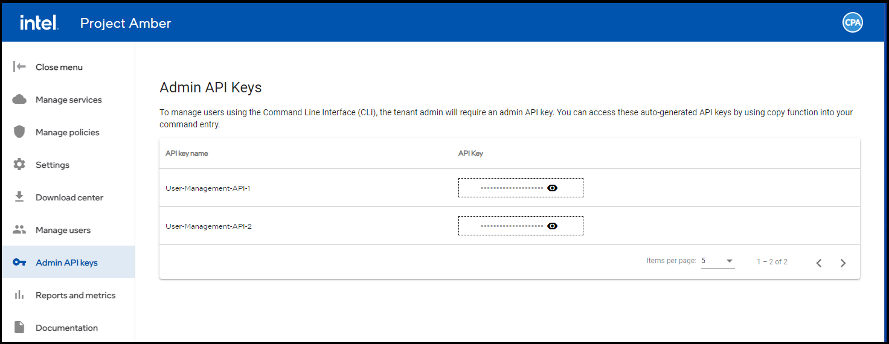

# Admin API key management

The Admin API Keys are needed to manage admins and users in Project Amber using the Command-Line Interface.

## View Admin API keys

1. Sign in to the Project Amber portal.
1. Select **Admin API keys**.
1. View the API keys in the table.

## Copy Admin API keys

1. Sign in to the Project Amber portal.
1. Select **Admin API keys**.
1. Go to the API key to be copied.
1. Select the view  icon for API key you want to copy.
    The API key is displayed.
1. Select the copy  icon. 
    The API key is copied to your system memory. 
1. The API key can be used with the Command-Line Interface to manage admins and users.