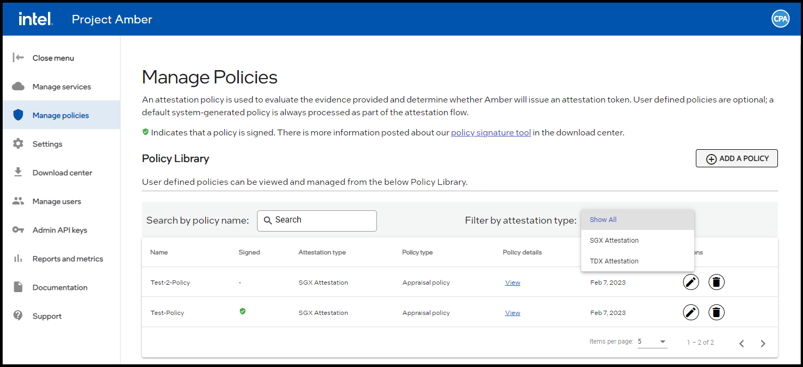
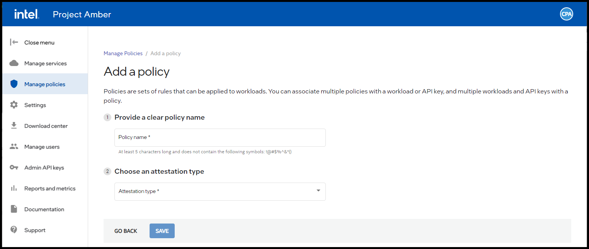
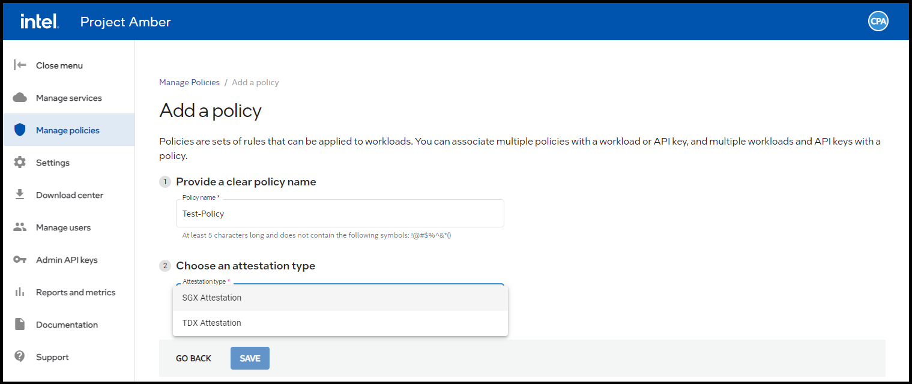
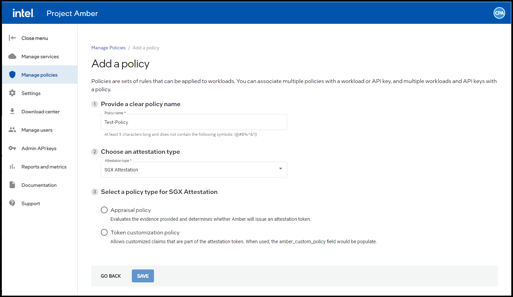
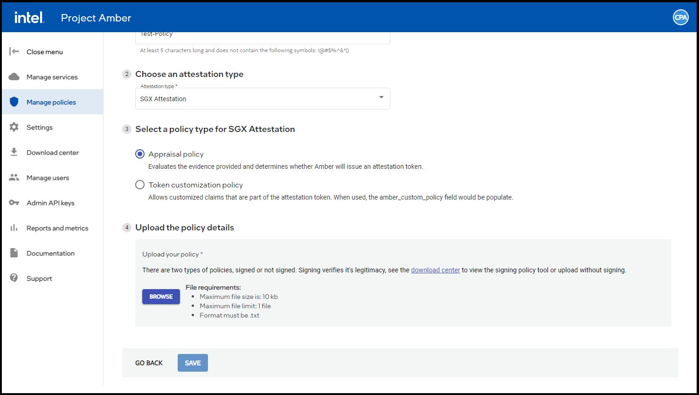
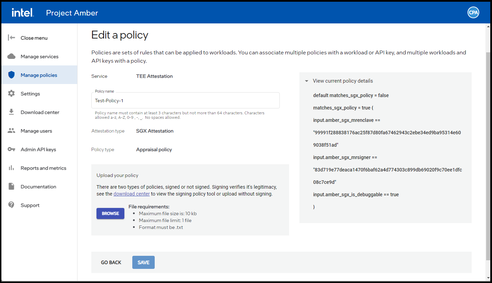

# Policy management

This article contains sample workflows for managing attestation policies. For additional detail on how policies are used, see the [Policies](concept-policies.md) article.

Policies can be managed using the Project Amber web interface, with the [client CLI](cli-policy-commands.md), or by [REST API](~/restapi/restapi-policy-management.md).

**Mandatory fields:**   
- API Key Name
- Product Type

**Optional fields:**   
- Scope
- Set of Policies & Tags

## Policy Types

There are two types of policies, Appraisal and Token customization. Appraisal policies evaluate the evidence provided and determines whether Project Amber issues an attestation toke. A Token customization policy allows customized claims that are part of the attestation token. 

Each policy type can be signed or unsigned. A signed policy is encrypted and more secure. The relaying party can be assured that the policy is unchanged.

## View policies

1. Sign in to the Project Amber portal.
1. Select **Manage policies**.
1. View the policies in the Policy Library pane.

    

## Search by policy name

1. Sign in to the Project Amber portal.
1. Select **Manage policies**.
1. In the **Search by policy name:** box, enter the policy name. The search is incremental. It begins after the first letter is entered. 
    The search results are displayed in the Policy Library pane.

## Filter by attestation type

1. Sign in to the Project Amber portal.
1. Select **Manage policies**.
1. Select the attestation type from the **Filter by attestation type:** dropdown list.
    
    The search results are displayed in the Policy Library pane.

## Add a policy 
1. Sign in to the Project Amber portal.  
1. Select **Manage policies**.  
     
1. Select **ADD A POLICY**.
1. Enter a **Policy name**.
    
1. Select an type of attestation type you want from the **Choose an attestation type** dropdown list.
    
1. Select a policy type for the selected attestation.
    
1. Select **BROWSE**.
    
1. Go to the policy.
1. Select the policy and then select **Open**.
1. Select **SAVE**.
    The Manage Policies page displays with the new policy displayed in the Policy Library pane. 

## Edit a policy  

1. Sign in to the Project Amber portal.
1. Select **Manage policies**. 
1. Select the  icon for the policy you want to edit.  
    
1. Select **EDIT POLICY**.  
  
1. You can edit the following:  
    - Policy name  
        1. In the Policy name box, enter a new name for the policy.  
    - Assign a new policy file  
        1. Select **BROWSE**.  
        1. Go to the policy file.  
        1. Select the policy file and then select **Open**.  
1. After your changes are made, select **SAVE**.   

## Delete a policy
1. Sign in to the Project Amber portal.
1. Select **Manage policies**.  
    
1. Select the  icon for the policy to be deleted.  
    
1. Select **DELETE POLICY**. 
    The policy is deleted.

## Sign a policy   

For instructions on signing a policy, see the [Policy Signing Tool](utility-policy-signing.md) article.
