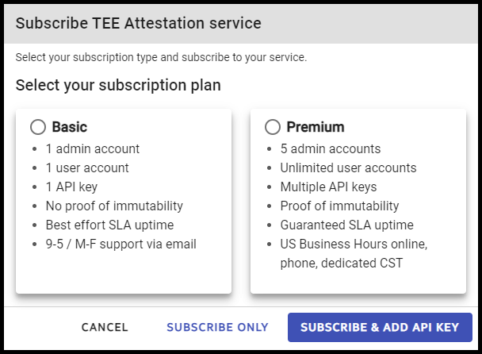

# Services management

Project Amber supports different services for each supported TEE (for example, Intel® SGX and Intel® TDX). To attest workloads using a given TEE, a tenant administrator will need to subscribe to the corresponding service.

Service subscriptions can also be managed using the [tenant CLI](cli-service-commands.md) or the [Service](~/restapi/restapi-service-management.md) REST APIs.

## Subscribe to a service

To subscribe to a service:

1. Sign in to the Project Amber portal.

1. Select **SUBSCRIBE**. 

   

1. Select a plan.

1. Choose from the following:

    - To subscribe to a service and not create an API key, select **SUBSCRIBE ONLY**. You will need to create an API key later. Follow the [Creating an attestation API key](howto-manage-api-keys.md) instructions to create an API key for the service.

    - To subscribe to a service and create an API key, select **SUBSCRIBE & ADD API KEY**. The *Add API key* page displays. Continue to the next step.

1. Enter a unique name for the API key. 
1. To save the API key, click **SAVE & CONTINUE**. The **Confirm service details** page displays.
1. To associate the API key to the service, click **SUBMIT**. 

Once subscribed, [API keys](howto-manage-api-keys.md) can be created for that service.

## Unsubscribing from a Service

To unsubscribe from a service, click **UNSUBSCRIBE**.  

> [!WARNING]
> Unsubscribing from a service will permanently delete all API keys and policies associated with the service. This action cannot be undone.

