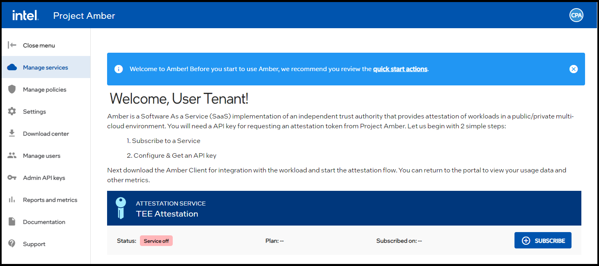
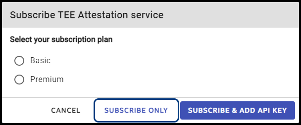
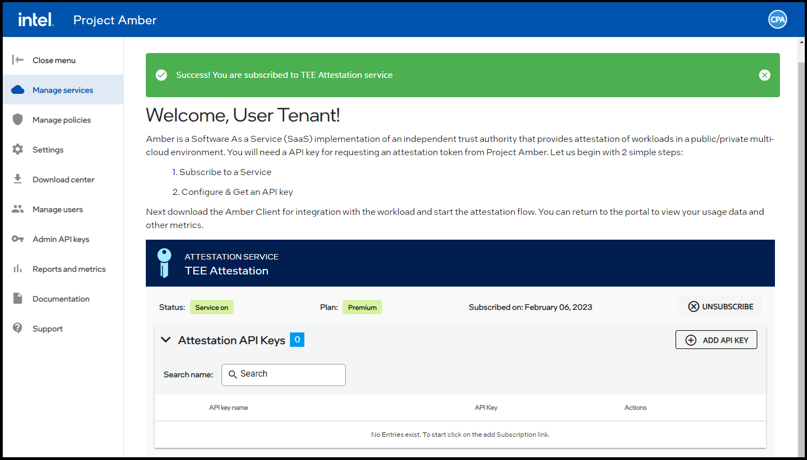
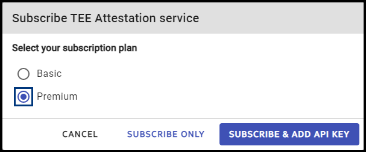
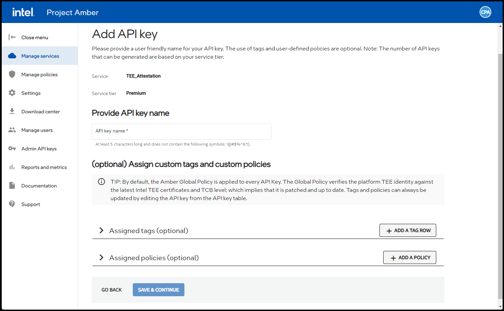
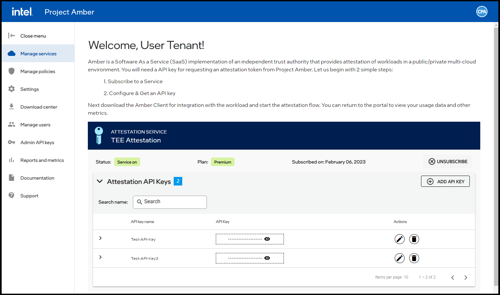

# Subscription management

Project Amber provides basic and premium subscription options.

### Premium subscription

The premium subscription level provides the following features:

- Five administrator accounts
- An unlimited number of user accounts
- Multiple API keys
- Token audit logging using blockchain ledger database
- Guaranteed SLA uptime
- 24x7 online, phone, dedicated CST

> [!NOTE]
> Only premium subscriptions are offered during the beta trial period.

### Basic subscription

The basic subscription level provides the following features:

- One administrator account
- One user account
- One API key
- No token audit logging
- Best effort SLA uptime
- 9-5, M-F support via email

> [!NOTE]
> The basic subscription level will not be available during the beta trial period.

### Changing your subscription level

You can change your subscription level at any time. Contact your Project Amber representative to ensure that proper authorization has been granted.

Sample SGX service subscription workflows are provided below.

## Subscribing through Microsoft Azure Marketplace

Subscribing to Project Amber through the Microsoft Azure Marketplace enables you to link your Azure account to your Project Amber account.

## Prerequisites

Before attempting to sign up for Project Amber through the Microsoft Azure marketplace, ensure you have the following information:

- **Microsoft Azure account** - You must have a pre-configured Azure account.
- **Valid email** - Do not use a no-reply email address. When a Project Amber account is set up, a sign-up link is sent to the email account.
- **Organizational Policies** - Ensure that no organizational policies restrict Project Amber's purchase.

1. Search for TEE Attestation in the Azure Marketplace.
1. Review the information on the TEE Attestation pages to answer any questions.
1. To start the subscription process, click **Get It Now**.
1. To allow Microsoft to share your account information with Project Amber, select the checkbox and then select **Continue**.
1. At the TEE Attestation (preview) page, select a plan :
   - Basic - contains one admin account, one user account, and one API key
   - Premium - contains five admin accounts, unlimited user accounts, and multiple API keys
1. Select **Subscribe**.
1. Enter your product details:
    1. From the Subscription dropdown list, select the subscription to manage.
    1. From the Resource Group dropdown list, select a resource group.
    > [!NOTE]
    > Alternatively, you can create a resource group. Click  **Create New** to create a resource group.
1. Enter the name of the subscription.
1. Select **Review + subscribe**.
1. Review the information on the Review + subscribe page to ensure it is correct.
    - If the information is correct, select **Subscribe**.
    - If the information is incorrect, edit the information and select **Subscribe**.
    When the account is set up, a message box displays in the upper right-hand corner of the page, and the **Configure account now** button is available.
1. To configure the Project Amber account, select **Configure account now**.
1. You must create an API key for your service. Select **ADD API KEY** and follow the instructions in the [Attestation API Keys](howto-manage-api-keys.md) article.

## Subscribing to an Attestation Service - subscribe only

1. Sign in to the Project Amber portal.
1. Select the **Manage services** icon from the Project Amber menu.
1. Select the **SUBSCRIBE** button.

    

1. Select a plan.
1. Select the **SUBSCRIBE ONLY** button.

    

     The subscription confirmation is displayed.

    

## Subscribing to an Attestation Service - subscribe & add API key

1. Sign in to the Project Amber portal.
1. Select the **Manage services** icon from the Project Amber menu.
1. Select the **SUBSCRIBE** button.

    

1. Select a plan.
1. Select the **SUBSCRIBE & ADD API KEY** button.

    

1. Enter an API key name in the box.

    

1. Select the **SAVE & CONINTUE** button.
1. Select the **SUBMIT** button.

## Unsubscribing from accounts

You can unsubscribe from an account at any time; however, there are ramifications to keep in mind:

- All API keys associated with the account will be lost.
- If a connection to the Project Amber service is required for the new account, you must create a new key.

## Unsubscribing from a service

> [!WARNING]
> Unsubscribing from a service will permanently delete all API keys and policies associated with the service. This action cannot be undone.

1. Sign in to the Project Amber portal.
1. Select the **Manage services** icon from the Project Amber menu.
1. Select the **UNSUBSCRIBE** button.

    

1. Select the **Yes, Done** button.
