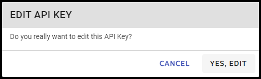
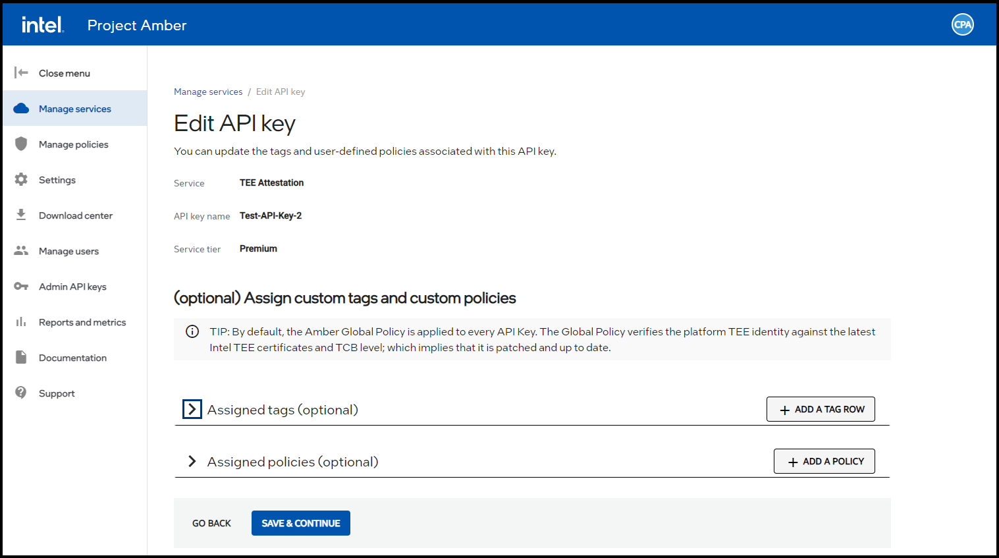
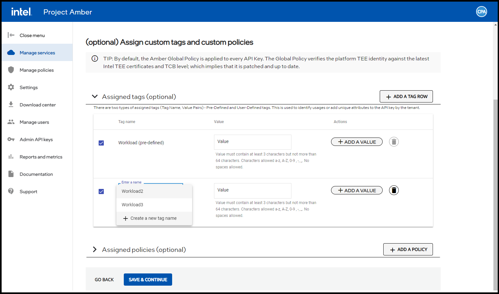
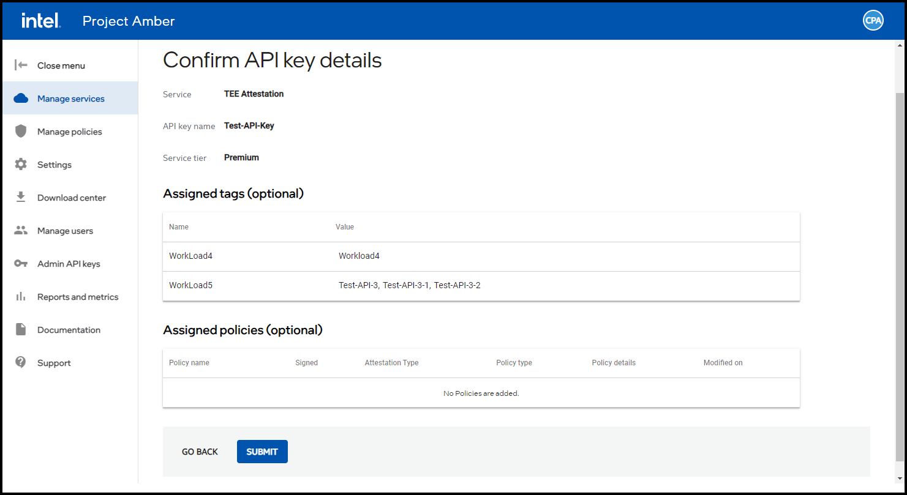
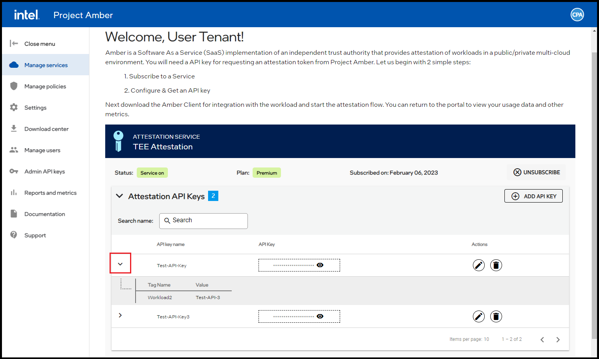

# Tag management

This article contains workflow examples related to tags, which are metadata elements like key-value pairs that can be applied to API keys. These can be used to identify usage based on settings that are relevant to your organization. 

## Add a tag
This option enables you to add a tag to an existing API key. 

1. Sign in to the Project Amber portal.  
1. Select the **Manage Services**.  
1. Select the **Edit**  button for the API key to which you are adding a tag.  
           
1. To confirm your intent to add a tag, select the **Yes, Edit** button.    
        
1. Select **ADD A TAG ROW**. 
1. Select the down arrow in the **Enter a name** box.
      
1. Select **Create a new tag name**.  
1. Enter a name for tag in the **Enter a tag name here** box. 
1. Optionally enter a value for the tag. 
1. Select the **Save & Continue** button.  
        
1. Select the **Submit** button.  
1. New Value is displayed in the Assigned tags (optional) pane.  

## View tags

1. Sign in to the Project Amber portal.
1. Select **Manage services**.
1. Select the dropdown arrow of an API key to view the tags associated to it.  
      
## Edit existing tags
You can add, edit, or delete values of an existing tag. You can disassociate a tag from an API key, select another tag to associate to the API key, but you cannot delete a tag once it's created. 

1. Sign in to the Project Amber portal.  
1. Select **Manage services**.  
1. Select the **Edit**  icon next to the API key associated to tag to be edited.  
      
1. Select the **YES, EDIT** button.  
    The **Edit API key** page displays.  
      
1. Select the arrow of the **Assigned tags (optional)** box.  
1. Select the dropdown arrow in the **Enter a name** box.  
        
1. To edit an existing tag name, choose from the following:   
    - To rename an existing tag value:  
      1. Select the down arrow in the **Enter a name box**.  
      1. Select a different name from the dropdown list.  
    - To add a new tag name:  
      1. Select the down arrow in the **Enter a name box**.  
      1. Select **Create a new tag name** from the dropdown list.  
      1. Enter a new name for the tag.  

1. To edit an existing tag value, choose from the following:  
    - To rename an existing tag value:  
      1. Delete an existing tag value.  
      1. Enter a new value for the existing tag.  
    - To add a new tag value:  
      1. Select **ADD A VALUE**.  
      1. Enter a value in the box.  

1. Select **SAVE & CONTINUE**.  
    The changes are reflected in the **Assigned tags (optional**)** section oof the **Confirm API keys details** page.
1. Confirm the information is correct. 
1. Select **SUBMIT**.  
    The changes are committed to the system.

