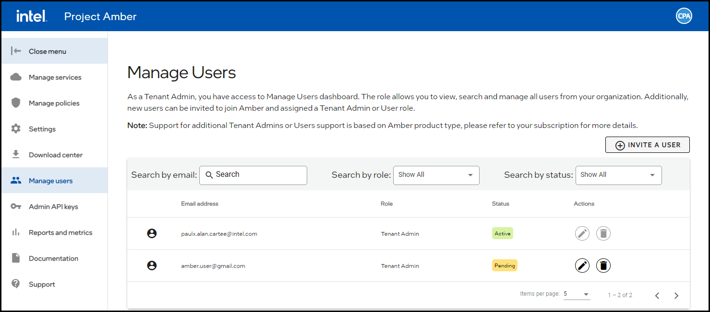
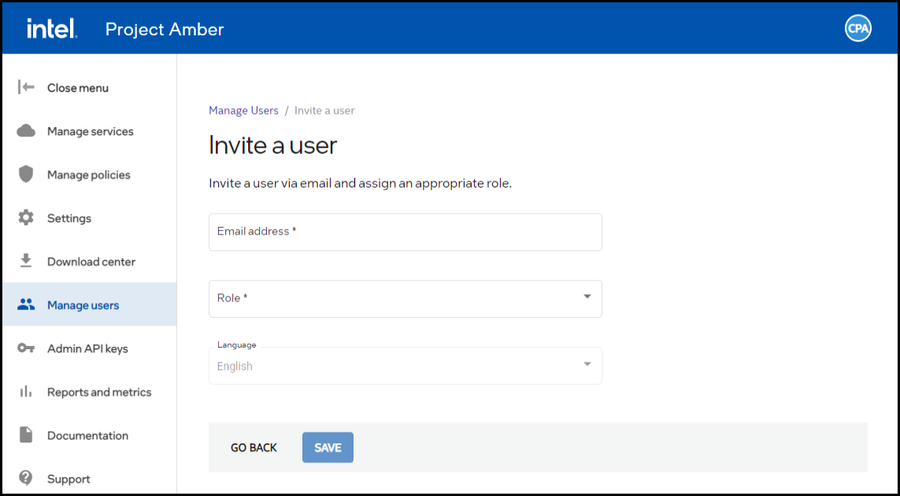
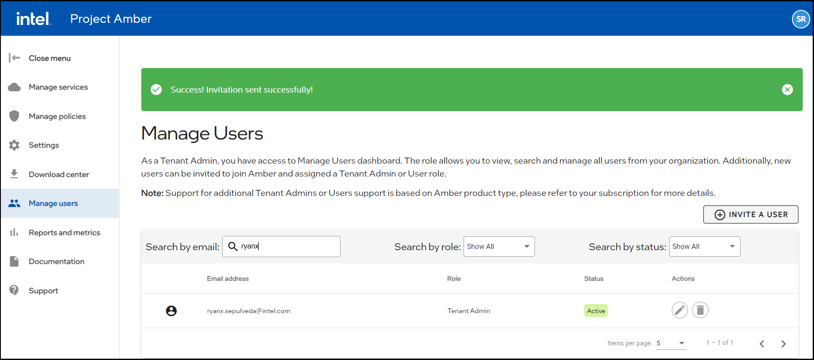
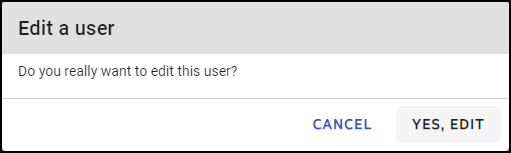

# User management

Project Amber user permissions are divided into _tenant admins_ and _users_. Tenant admins can perform all regular user functions and manage other users through the Manage Users dashboard. At least one active tenant admin is required and is automatically assigned to the first Project Amber subscriber from a tenant organization. Only tenant admins can invite, edit, and delete users.

These functions are also supported via [CLI](cli-user-commands.md) and [REST API](~/restapi/restapi-tenant-management.md).

## View tenant admins and users

1. Sign in as a tenant admin.
1. Select **Manage users**.

     

     The user, their roles and status are listed in the table. 

## Invite a new user

1. Sign in as a tenant admin.
1. Select **Manage users**.  
      
1. Select the **INVITE A USER** button.  
    
1. Enter the user's email.
1. Select the role for the new user.
1. Optionally select a language for the user.
1. Select **SAVE**.
     The invitation is emailed to the user.

## Search for users by email

1. Sign in as a tenant admin.
1. Select **Manage users**.

    

1. In the **Search by email:** box, enter the user's email. This is an incremental search. The search starts when the first letter is entered.

    

     The users with emails addresses matching the search results are displayed in the table.

## Search for users by role

1. Sign in as a tenant admin.
1. Select **Manage users**.

    

1. Select the role option (**Select All, Tenant Admin, User**) from the menu.
     The users matching the selected option are displayed in the table.

## Search for users by status

1. Sign in as a tenant admin.
1. Select **Manage users**.

    

1. Select the status option (**Show All, Active, Pending**) from the menu.
     The users matching the selected option are displayed in the table.

## Update user roles

1. Sign in as a tenant admin.
1. Select **Manage users**.

    

1. Identify the user to update.
1. Select the **Edit**  icon.

    

1. Select the **Yes, Edit** button.
1. Select the updated role from the menu.
1. Select the **Save** button.
1. The user is updated, and the updated user info is displayed in the Active Users pane.

## Delete users

1. Sign in as a tenant admin.
1. Select the **Manage Users** icon from the Project Amber menu.

    

1. Identify the user to delete.
1. Select the **Delete** actions button.
1. Select the **Yes, Delete** button. 
1. The user is deleted, and the deleted user is removed from the Active Users pane.

> [!NOTE]
> A user's policy, tags, and API keys are **not** deleted when the user is deleted.
