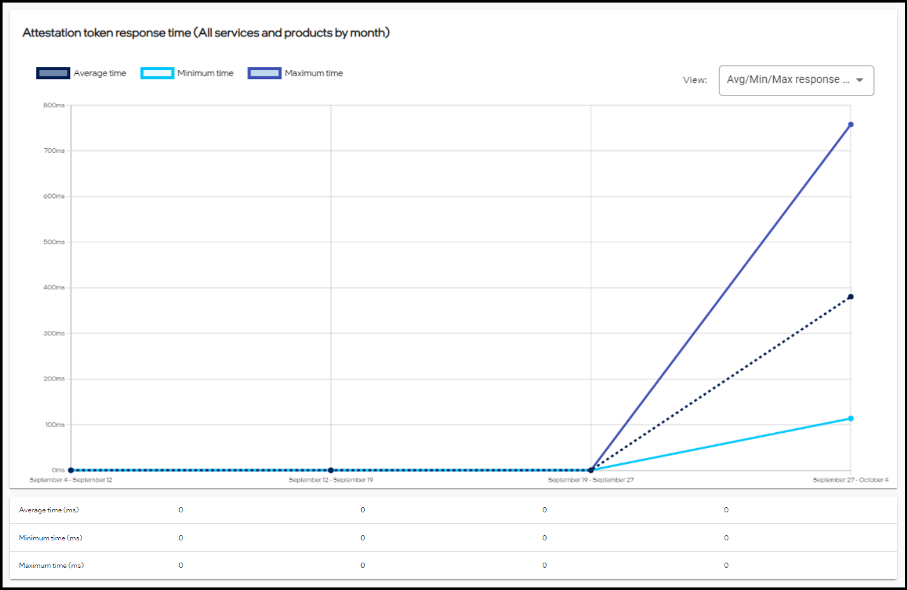
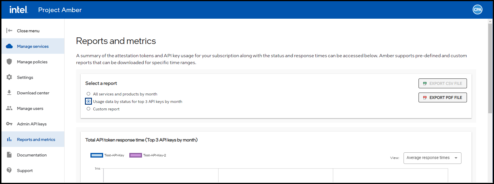
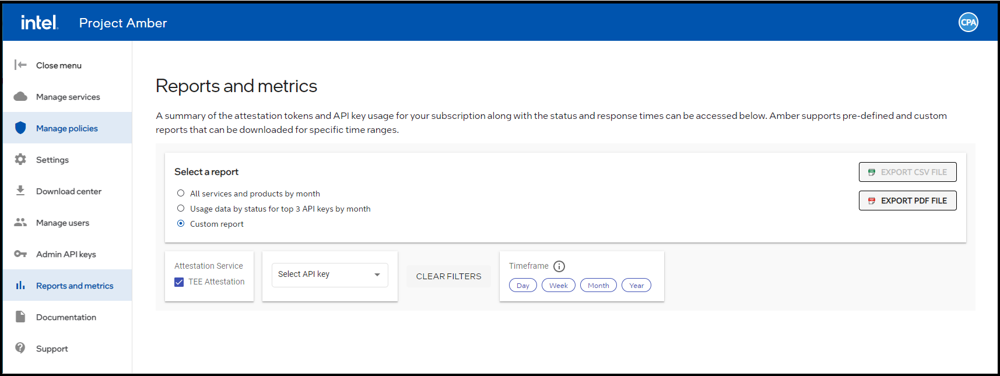

# Reports and metrics management

This article provides information about the reports and metrics functions of Project Amber. Reports and metrics can provide a summary of the attestation tokens and API key usage for your subscription along with the status and response times. Project Amber supports pre-defined and custom reports that can be downloaded for specific time ranges. These reports can be exported to a CSV file or a PDf file.

Three report options are available for selection.

- All services and products by month.
- Usage data by status for top three API keys by month.
- Custom reports.

These functions are only available on the Project Amber web interface.

## Select a report — all services and products by month

1. Sign in to the Project Amber portal.
1. Select **Reports and metrics**.

1. Under **Select a report**, select the **All services and products by month**  radio button.

     

1. In the Attestation token response time pane, Click the **View** option from the drop-down menu.
1. A summary of the search results is displayed.

       

1. In the Total attestation token requests usage and status data pane, select the **View** option from the drop-down menu.
1. A summary of the search results is displayed.
1. Select the export option (CSV or PDF).
1. The report is downloaded and available to view.

## Select a report — usage data by status for top three API keys by month

1. Sign in to Project Amber.
1. Select the **Reports and metrics** item from the Project Amber menu.

1. Select the **Usage data by status for top 3 API keys by month** button.

     

1. In the Attestation token response time pane, select the **View** option from the drop-down menu.
1. A summary of the search results is displayed.
1. In the Total attestation token requests usage and status data pane, select the **View** option from the drop-down menu.
1. A summary of the search results is displayed.
1. Select the export option (CSV or PDF).
1. The Report is downloaded and available to view.

## Select a report — custom

1. Sign in to Project Amber.
1. Select the **Reports and metrics** item from the Project Amber menu.
1. Select the **Custom** radio button.

     

1. Select the **Select API key** from the arrow drop-down menu.
1. Select the desired **Timeframe**  button.
1. In the API token response time (Custom report) pane, select the **View** option from the drop-down menu.
1. A summary of the search results is displayed.
1. In the API token status and usage data (Custom report) pane, Select the **View** option from the drop-down menu.
1. Select the export option (CSV or PDF).
1. The report is downloaded and available to view.

