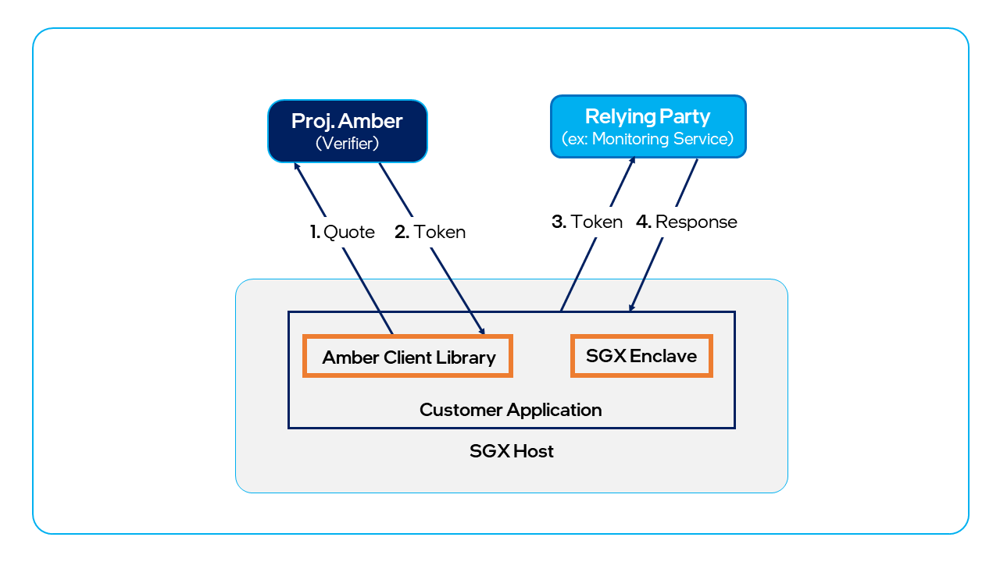

# Project Amber Go Client 
 
Intel’s Project Amber client allows your applications to interact with native TEE enclaves using Project Amber attestation services. The term _native TEE enclave_ applies to the use case in which an untrusted application loads a trusted TEE enclave that is not running within a libOS such as Gramine.

A key integration goal of the Project Amber client is to minimize required changes to existing applications. The Project Amber client encapsulates all of the functions and workflows required to generate a quote, package it as evidence, and send it to the Project Amber SaaS by calling the Project Amber APIs. The Project Amber Client is a unified set of libraries intended to be used both for workloads and relying parties.

Currently the Project Amber client is offered for Golang only. Additional language bindings for the Project Amber client libraries for popular languages are planned for future release based on customer needs.

## Prerequisites

This article assumes the reader has a working understanding of development using one or more TEEs, such as [Intel® SGX development](https://www.intel.com/content/www/us/en/developer/tools/software-guard-extensions/get-started.html), [Intel® TDX development](https://www.intel.com/content/www/us/en/developer/articles/technical/intel-trust-domain-extensions.html), Enclave Definition Language (EDL), and Intel® SGX report/quote creation. Readers that want to integrate with Project Amber but are not familiar with development using these technologies may want to use [Gramine integration](concept-gramine-integration.md).

## Project Amber Go client overview

The Project Amber Go client can be found at https://github.com/intel/amber-client. The client is distributed as a collection of libraries that let you include only the libraries you need. At minimum, you will need the **go-client**, and additionally you can include one or more adapters to interact with TEEs.

**go-client** — This module is responsible for creating a secure connection to Project Amber and invoking the attestation-related REST APIs of Project Amber. Developers who only want to interact with Project Amber via REST (that is, _not_ collecting TEE quotes) can import this module into their application and call into the interfaces exposed.

[**go-sgx**](integrate-go-sgx.md) — This module is responsible for generating a Intel® SGX quote. **go-sgx** interacts with DCAP Quote Generation library to get the quote for a SGX enclave report. <!-- Customers who are looking for an end-to-end solution to get the attestation result from Project Amber can additionally integrate this module to interface with Amber to get an attestation token. --> 

<!--  -->

[**go-tdx**](integrate-go-tdx.md) — This module is responsible for remotely attesting a Intel® TDX VM workload. 

[**amber-cli-tdx**](integrate-go-tdx-cli.md) — This module provides a Intel® TDX CLI implementation. The CLI lets you use the BASH command line or add TDX attestation to applications in languages other than Go. 
    
Adapters are partly developed in C++ to work with DCAP. The Go clients encapsulate low-level calls to the adapter. The next few sections give a summary of the interfaces exposed according to client.

> [!NOTE]
> The Microsoft Azure Attestation (MAA) adapter is _not_ a Go client TEE adapter. MAA adapter is a service that allows Azure applications use Project Amber attestation. For more information, see [MAA adapter](concept-maa-adapter.md).

### go-client

- `client.new`: Initializes an instance of Project Amber client to be used for communication with Amber. It takes the Project Amber URL and an Amber API key as input.

- `client.CollectToken`: Interfaces with Project Amber to get the attestation result for the workload. It takes `EvidenceAdapter` and Project Amber attestation policy IDs as input and provides an Project Amber attestation token as output.

- `client.GetNonce`: Retrieves a new signed nonce from Project Amber to be used for enclave report creation. It does not take any input.

- `client.GetToken`: Creates a new Project Amber attestation token corresponding to an input Intel® SGX quote. It takes Project Amber signed nonce, Project Amber attestation policy IDs and Evidence (an Intel® SGX quote) as input.

- `client.VerifyToken`: Verifies the Project Amber attestation token to ensure that the token is generated from a genuine Project Amber Attestation Service. It takes an Amber attestation token as input.

## Go-client integration example

This section describes an end-to-end Project Amber integration example written in Go. It can be used as a reference for integrating your own Intel® SGX enclaves into a Go-based executable.

> [!NOTE]
> Prior to integrating an Intel® SGX workload with the Project Amber client, the workload must implement a function to generate an enclave report. This function should take the sha256 hash of the `nonce` and user data to form `report data` for the `sgx_create_report` API. The Project Amber Attestation Service performs a `report data` verification where it expects the `report data` to be a sha256 hash of `nonce` and `user data`.

### Code example

The following Go code sample instantiates a minimal, simple Intel® SGX enclave. The code creates a public key, attests the enclave, and validates the resulting attestation token.

[!INCLUDE[Simple SGX enclave code sample](include/code-sgx-enclave.md)]