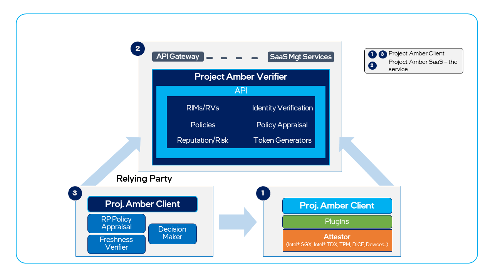
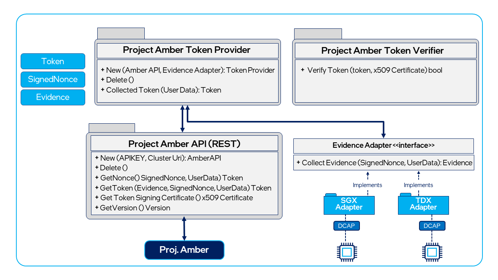

# Understanding Project Amber integrations

The articles in this section contain information on how to integrate Project Amber into your applications. Integration refers to the process of using the Project Amber client to add quoting and attestation functions to an existing application. The Project Amber client encapsulates all of the functions and workflows required to generate a quote, package it as evidence, and send it to the Project Amber service by calling the Project Amber APIs. A key integration goal of the Project Amber client is to minimize needed changes to existing applications. 

## Project Amber components

Project Amber has two major components that work in tandem to provide trust verification and attestation of workloads.

- The Project Amber service — this is the SaaS (Software-as-a-Service) back-end service that you interact with via the APIs. The Project Amber service is a collection of microservices that are instantiated on demand to perform different functions, such as policy appraisals, quote verification, and TEE (Trusted Execution Environment) caching.

- The [Project Amber Go client](integrate-go-client.md) — a set of libraries integrated with the workloads to provide attestation, evidence-quoting capability, and an interface to the Project Amber SaaS microservices.

The Project Amber client can be integrated using two methods.

- Project Amber client for applications that utilize TEE SDKs, such as Intel® SGX and Intel® TDX.

- Project Amber client for Gramine.

## Attestation client library

The following functional diagram of the Project Amber Go client shows the attestation flow and some of the interfaces provided by the Go client and TEE adapters. The Go client encapsulates calls to the Project Amber service. 

- The Project Amber client is split into several different libraries (files) so that they can be deployed for specific use cases. You can include only the libraries that are relevant to the TEE(s) in use. For example, a relying party may only need the AmberAPI to facilitate REST communications with Project Amber. 

- The `AmberClient` library is the key library that interfaces with the Project Amber service by using a REST API.

- The `CollectToken` function simplifies token collection. It is an aggregate function that implements the full workflow to request a nonce from the Project Amber service, invoke the appropriate `EvidenceAdaptor`, package the evidence, and then invoke the Project Amber service API to fetch the attestation token.

- The `EvidenceAdapter` interface abstracts the collection of platform specific evidence (quotes).  Evidence adapters are developed as individual libraries to promote expansion and minimize the dependency chain. For example, a user of Intel TDX does not need to install the binaries for Intel® SGX.

- All TEE adapters are separate libraries, allowing developers to use the appropriate adapter for the TEE enabled on the platform.

- The Project Amber client provides a unified library for both workload owners and relying parties. A relying party can use the same libraries used by the workload when using the background attestation model.

For more information, see [Integration using the Project Amber Client](concept-client-integration.md).

## Amber client for Gramine

Project Amber supports using [Gramine](https://gramineproject.io/). Gramine is a lightweight library operating system designed to allow an entire application to run in an enclave with minimal or no changes needed to the application itself. To facilitate the goal of few-to-no changes to existing applications, the Project Amber Client is natively integrated into the Gramine LibOS. 

For more information, see [Gramine integration with Project Amber](concept-gramine-integration.md).

## Key considerations

Project Amber provides a trusted attestation authority for confidential computing and similar use cases. For more information about common confidential computing scenarios and working with TEEs, see [Attestation with Project Amber](concept-attestation-overview.md).

