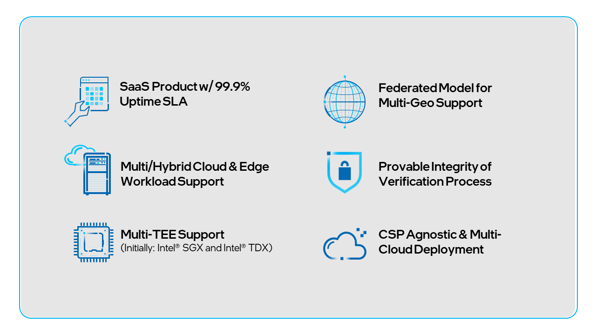
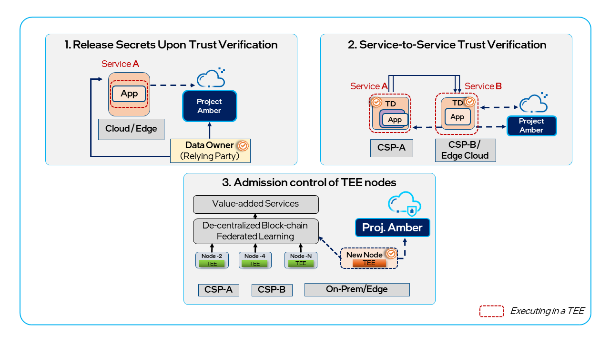
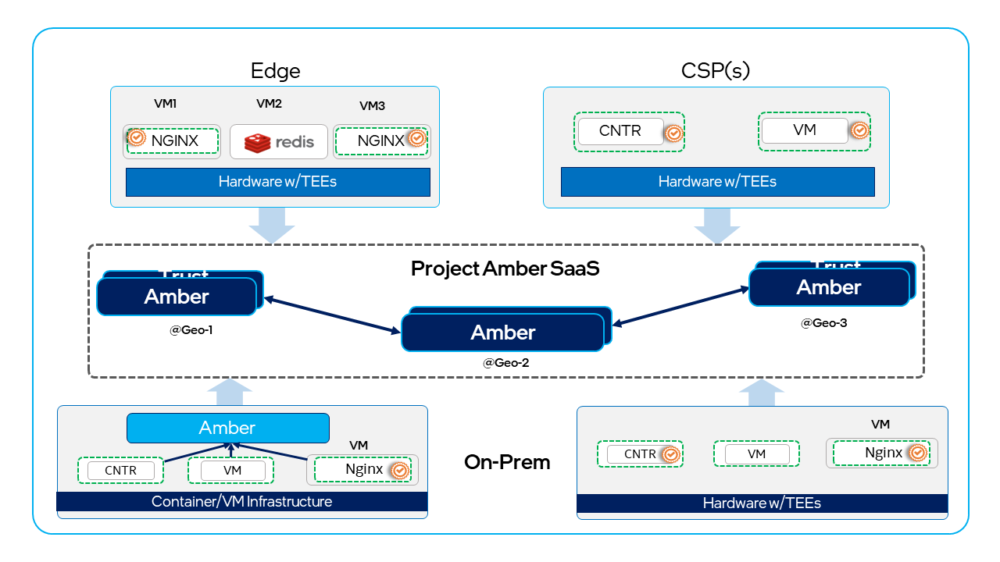

# Introduction to Project Amber

Project Amber is Intel’s groundbreaking Software as a Service (SaaS) implementation of an independent trust authority that provides attestation of workloads in public and/or private, multi-cloud environments. It remotely verifies and asserts trustworthiness of compute assets, such as Trusted Execution Environments (TEEs), devices, Roots of Trust, and more! The service is operationally independent from the cloud or edge infrastructure provider hosting the confidential computing workloads.

## Key Benefits

- Enables enterprises to use a single trust authority regardless of where the workload runs.
- Integrates with a cloud provider’s assurance services as a value-add, or acts as an independent, third-party assessment, increasing confidence in the trustworthiness of sensitive workloads.
- Designed to be cloud-agnostic, Project Amber supports workloads in the public cloud, within private or hybrid cloud, and at the edge.

Intel® is working with independent software vendors (ISVs) to enable trust services that include Project Amber. New tools, such as published APIs that enable ISVs to incorporate Project Amber to augment their own software and services, will complement Intel’s platforms and technologies and increase value to customers and partners.

Project Amber is Intel’s first step in creating a new multi-cloud, multi-TEE service for third-party attestation and will drive adoption of confidential computing for the broader industry. The initial customer pilot supports confidential compute workloads deployed as bare metal containers, virtual machines (VMs), and containers running in virtual machines using Intel TEEs. The intent is to extend coverage to other TEEs in the future.

## Getting Started

At a high level, Project Amber requires:

- An application workload that uses a supported TEE.
- A Project Amber attestation API key.

[Creating API Keys for attestation](howto-manage-api-keys.md) 

[Quick application integration](concept-integrations-overview.md)

[Sample attestation use cases](concept-usecases-overview.md)

